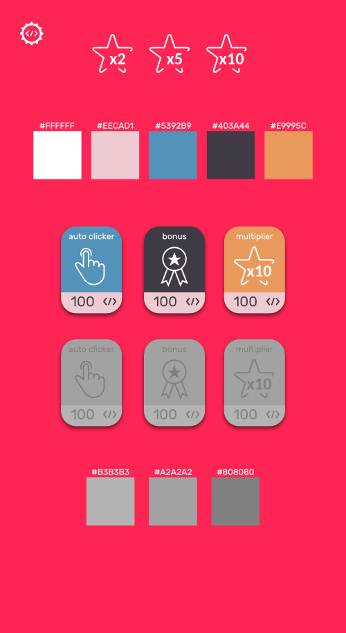
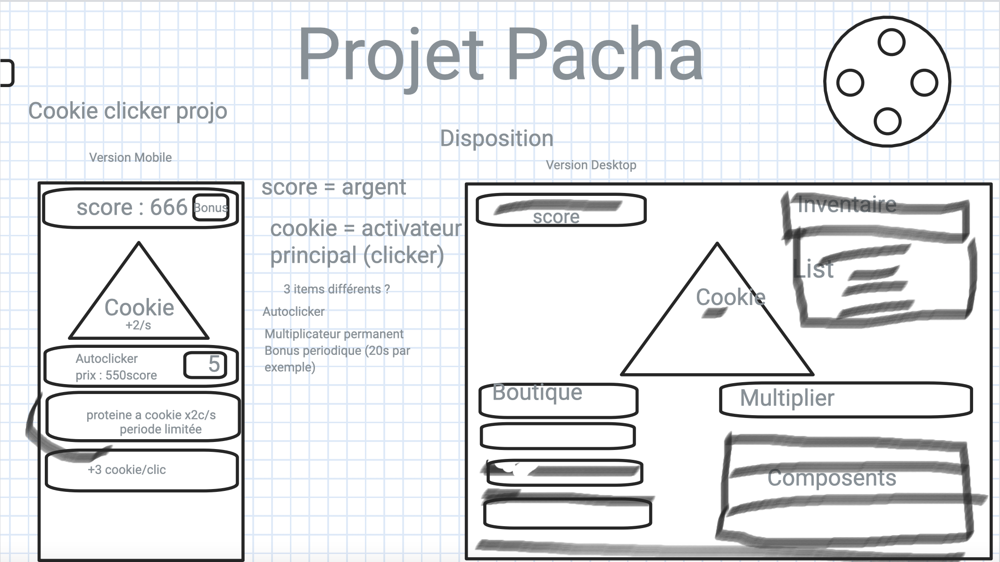
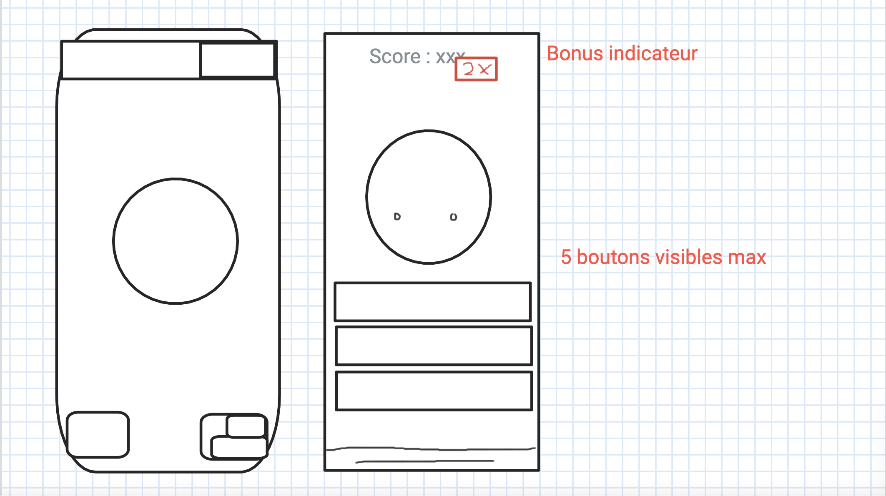
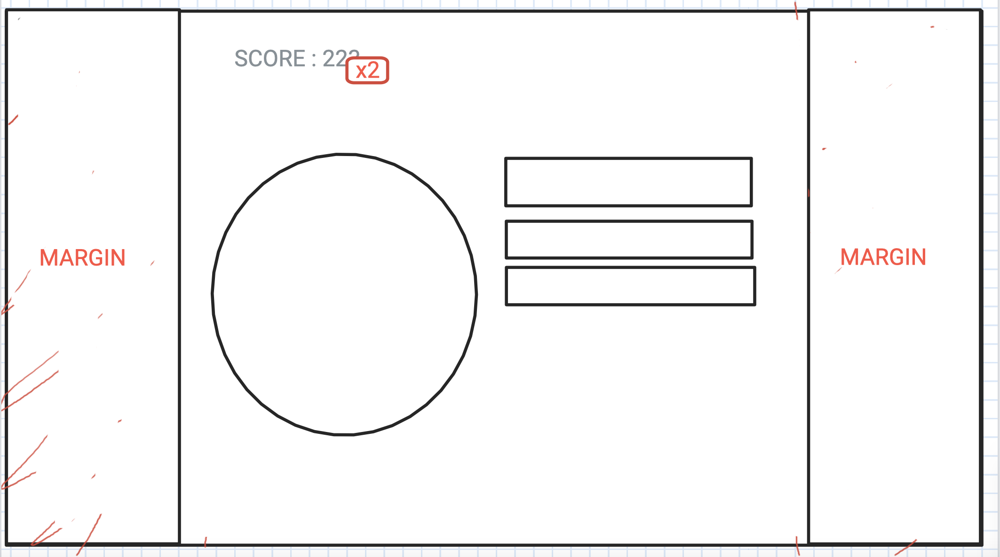
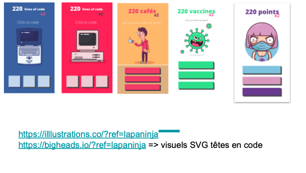
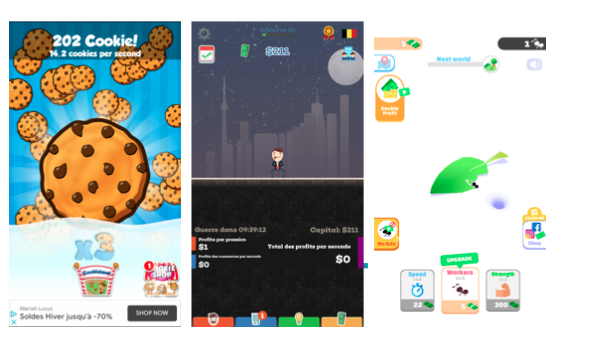
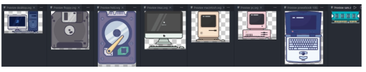

# cookie-clicker

Collaborative project of an incremental game / cookie clicker

## Checkout our page
[GitHub Page](https://marchoutreille.github.io/cookie-clicker)

### Font-type for buttons: 
Rubik
* to add inside css file

``@import url('https://fonts.googleapis.com/css2?family=Rubik&display=swap');
``
* to use it for styling: ``font-family: 'Rubik', sans-serif; ``

### colors:
##### active colors:
* #FFFFFF
* #EECAD1
* #5392B9
* #403A44
* #E9995C

##### inactive colors:
* #B3B3B3
* #A2A2A2
* #808080
  

### Images:

[Source des illustrations](https://illlustrations.co/?ref=lapaninja)

Branches :

-------Main

         \--- Dev
         
              \------ Pauline
              
               \------ Thomas
               
                \------ gonzalo
                
                 \------ Marc

### Organisation du projet: 

Thomas : Project Manager

#### Vendredi :

Choix du projet et définition de la structure du site web

#### Lundi :

1)Réalisation d'un mood board pour définir le thème du projet.

##### Différentes idées proposées 

##### Inspirations pour le projet

##### Idée de mettre en place une image changeante selon l'avancée du jeu

2) Répartition des tâches dans l'équipe. Choix dans l'équipe de ne pas se répartir les tâches de manière séparée HTML/CSS et JAVASCRIPT. 

Vision globale commmune du projet qui permettait de pouvoir le faire.

- Structure HTML 
- Réalisation graphique des boutons
- Initialisation du jeu en JavaScript 
- 

Mardi : 

- functions (bonus + update)
- Création des animations sur css
- Cloture de la réalisation graphique des boutons + export des SVG
- Basic game design

Mercredi : 

- Cloture functions JS
- Intégrations des boutons graphique dans la page web
- Rendre le site responsive
- Styliser le footer
- Terminer le Readme

## Purpose

Ce projet nous a appris a travailler en groupe. Nous avons aussi pu améliorer nos connaissances en JS.

## Participation

Ci dessous le nom des participant a ce projet :

- [Doomsmash](https://github.com/Doomsmash)
- [rohmerpauline](https://github.com/rohmerpauline)
- [MarcHoutreille](https://github.com/MarcHoutreille)
- [gonzalovsilva](https://github.com/gonzalovsilva)
